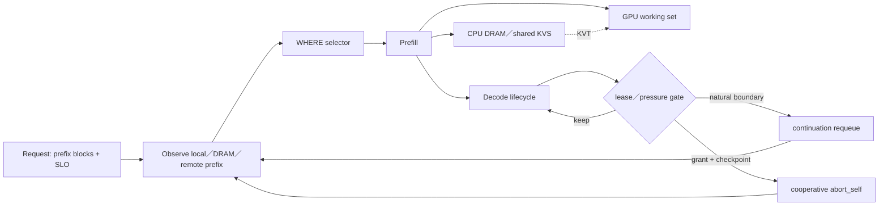

# Prefill Cache Simulator：策略价值与 benchmark 诚实性审计

- 作者：张珮文
- 证据版本：`prefill-cache-sim@2f324ead2a3d912ef4301ee3692f83b5dfe3aa75`
- 数据集：Mooncake `mooncake_trace.jsonl`，23,608 requests，512-token prefix blocks
- 证据等级：论文原文＋本地 deterministic replay；真实 GPU／KVT／生产 shadow 仍未完成

## 0. Data Description：这份 trace 到底给了什么

### 0.1 文件与字段

实际使用文件 SHA-256：`b434f1816a707f4bac697235588184ebc374c9907cb981bb65fb0643471fe711`，4.2 MiB，23,608 行 JSONL，覆盖相对时间 0～3,600,000 ms。每一行只有四个原生字段：

| 字段 | 含义 | 可以推导什么 | 不能推导什么 |
|---|---|---|---|
| `timestamp` | 相对到达时间，单位 ms | arrival order、inter-arrival、idle age | 真实日期；同毫秒内的真实先后 |
| `input_length` | prompt token 数 | prefill work、tail block 大小 | token 内容、语义、模型 template |
| `output_length` | decode token 数 | decode work proxy | 实际 TPOT、finish reason、优先级 |
| `hash_ids` | 512-token block 的 chained prefix hash ID | exact-prefix reuse relationship | 原始 token、session_id、user_id |

数据文件实测统计：

| 指标 | 值 |
|---|---:|
| Requests | 23,608 |
| Input tokens | 202,791,701；mean 8,589.96；median 6,345；interpolated P95 26,078.55；range 890～125,546 |
| Output tokens | 4,299,817；mean 182.13；median 30；P95 600；range 1～2,000 |
| Block references | 409,356 |
| Unique block IDs | 183,166 |
| Partial-tail requests | 23,581／23,608 |
| Unique timestamps | 1,180；adjacent same-timestamp pairs 22,428 |

论文正文写 average input length 7,590，但当前公开文件的精确和是 202,791,701，除以 23,608 得 8,589.96。本仓所有结果以固定 SHA 的实际文件为准，不修改数据去贴论文平均值。

### 0.2 为什么 block size 是 512

论文定义 `hash_ids[i]` 为第 `i` 个 512-token block 的 prefix hash：它不仅包含当前 block，还链入之前所有 block。因此相同 ID 表示“从 prompt 开头到这里都一致”。一条 `input_length=6,755` 的请求有 `ceil(6755/512)=14` 个 ID；前 13 块各 512 tokens，最后一块 99 tokens。loader 在 `trace.py:104-120` 严格验证这个关系。

这也决定了命中必须是 strict prefix：如果 block 0、1 命中，block 2 miss，即使 block 3 恰好 resident，也不能跳过 block 2 继续算 hit。实现见 `cache.py:45-71` 与 `analyzer.py:68-77`。

### 0.3 Block hit 与 Token-weighted hit

| Metric | 分子 | 分母 | 为什么两个数不同 |
|---|---|---|---|
| Block-ref hit | 所有请求中连续命中的 block reference 数 | 409,356 block references | 每块按 1 计数，partial tail 也算一块 |
| Token-weighted hit | 连续命中 block 实际覆盖的 token 数 | 202,791,701 input tokens | 完整块计 512，tail 按真实 token 数 |

无限容量、无过期、strict prefix 的 workload ceiling：

- Block-ref：`226,190 / 409,356 = 55.2550836%`。
- Token-weighted：`115,733,271 / 202,791,701 = 57.0700233%`。

Token-weighted 更高，说明被复用的完整长 block 略多，而大量 compulsory miss 落在短 tail。两个 metric 都是 cache reuse，不是 request hit rate，也不是 TTFT improvement。

### 0.4 Idle TTL 实验的准确假设

Idle TTL 是本仓额外的 diagnostic，不是 Mooncake Table 1，也不是论文配置。其假设必须完整写成：

1. **Capacity infinite**：不发生容量 eviction。
2. **Idle expiration**：`now - last_access > TTL` 时 block expire；不是“创建后固定寿命”。
3. **Hit renew**：命中的 block 把 `last_access` 刷新到当前 request timestamp，这等价于 LRU recency refresh。
4. **Strict prefix matching**：遇到第一个不存在或过期的 block，后续 block 全部不计 hit。
5. **Instantaneous trace-time insertion**：lookup 后把当前请求的 blocks 立即写入并更新时间；不模拟 prefill queue／completion visibility。
6. **Single global namespace**：不是 per-GPU cache，也没有 remote transfer cost。

| Idle TTL | Block-ref hit | Token-weighted hit |
|---:|---:|---:|
| 1 s | 28.81% | 29.77% |
| 5 s | 33.75% | 34.89% |
| 10 s | 33.95% | 35.08% |
| 30 s | 34.96% | 36.12% |
| 60 s | 37.92% | 39.17% |
| 120 s | 44.33% | 45.79% |
| 300 s | 51.10% | 52.78% |
| 600 s | 54.53% | 56.33% |
| 1,800 s | 55.22% | 57.04% |
| 3,600 s／∞ | 55.26% | 57.07% |

这张表只回答 temporal locality 能跨多长时间。它不包含 LRU capacity eviction；严格说是“infinite capacity＋idle expiry＋hit renew”，不能简称为“LRU benchmark”。

### 0.5 能否判断 session

**不能确定真实 session。**数据集没有 `session_id`、`conversation_id`、`user_id` 或 messages。论文只说采样时优先保留同 session 请求，以保存 caching relationships；这不等于 trace 暴露了 session label。

`hash_ids` 只能构造 causal prefix family proxy：

- 同一 session 的追加对话通常共享较长 prefix，因此可能被 link。
- 不同 session 也可能共享 system prompt／相同文档，因此会 false merge。
- 同一 session 如果 template、截断或上下文发生变化，也可能 false split。
- depth=1 只有 4 个 prefix families，最大 family 有 10,938 requests，证明第一块主要是超热公共前缀，不能拿它当 session key。
- 23,608 requests 只有 1,180 个不同 timestamp，同毫秒内无法恢复真实会话顺序。

S4 的 `OnlineConversationLinker` 因而明确是 online proxy：只使用当前请求之前见过的 prefix，要求 minimum shared blocks，排除 hot-only prefix，并设置 family size cap（`affinity.py:37-114`）。在真实系统里应替换为经过 privacy-safe hashing 的真实 session key；当前 S4 结果不能宣称是“真实 session selector 收益”。

## 1. 总体架构

### 先给结论

1. **这份 trace 的 exact-prefix workload ceiling 是约 51%～57%，不是 90%。**论文的 global LRU infinite-capacity 是 0.51；本仓按 block reference 复算为 55.255%，按 token 加权为 57.070%。
2. **当前已实证的最大收益来自“把相同前缀重新聚到一起”。**S3 从 Random 的 44.30% 提升到 54.01%，增加 9.71 pp；54.01% 是有限多节点 local cache，57.07% 是无限单池 token ceiling，94.6% 只能作空间利用参照；代价是 request load max/mean=1.822。
3. **最值钱的设计不是单个 selector，而是 KVS-aware、SLO-aware 的统一 marginal-cost decision。**它把 `local reuse`、`remote transfer`、`recompute`、`queue`、`SLO risk` 放进同一个选择题，并允许在 D stream 过载时避免继续浪费 GPU work。
4. **Decode lease／cooperative preemption 的潜在收益可能比剩余 cache hit 更大，但证据最弱。**D1 在单 D node 的极端阻塞中把 strict goodput 从 0.00718 提到 0.14181，约 19.7×；到 2 个 D node 时反而低于 D0。它是 pressure tool，不是 always-on policy。
5. **当前 tier 假设没有伪造 Mooncake benchmark，但不能称为 Mooncake reproduction。**prefix 语义、LRU、global DRAM/KVS、remote-vs-recompute 都同构；GPU residency、layer-wise overlap、SSD swap、network congestion、真实 TTFT/TBT 尚未被硬件标定。



## 2. 详细设计

### 2.1 理论上限：先分清三种 ceiling

| 层级 | 数字 | 它回答什么 | 不能回答什么 |
|---|---:|---|---|
| Mooncake global LRU，Inf | 51% | 论文 Table 1 的单 global cache 口径 | 多节点 local selector 的命中 |
| 本仓 block-ref ceiling | 55.255% | block reference 是否曾经出现并可连续复用 | token 节省比例 |
| 本仓 token-weighted ceiling | 57.070% | 最多多少 input tokens 可由 exact prefix 提供 | TTFT／goodput |
| 90% reuse | 另一个 workload | chat-to-paper 等重复长上下文 | 这份 arxiv trace 的上限 |

代码入口：`src/prefill_cache_sim/analyzer.py`；trace prefix 必须连续命中，见 `cache.py:45-71`。

### 2.2 Selector：每种方案赚什么、卡在哪里

```python
# src/prefill_cache_sim/selectors.py:218-238
hit = cache_hits.get(node.node_id, (0, 0))[1]
score = load(node) + request.input_tokens - cache_discount * hit
# FlexLB 风格：queue work 与 saved prefill work 合成一个近似分数。
```

| 策略 | 决策规则 | M4 token hit | 最大收益点 | 瓶颈／诚实边界 |
|---|---|---:|---|---|
| S0 Random | 均匀随机 | 44.30% | 无偏 baseline | 打散 temporal locality |
| S1 RoundRobin | 请求轮转 | 44.25% | request load max/mean=1.0 | 不看 token work 与 prefix |
| S2 LeastWork | 最少 running＋queued tokens | 43.67% | 负载感知 | 主动打散 prefix，命中最低 |
| S3 GBPrefixBucket | prefix anchor stable owner；过载 bounded fallback | **54.01%** | **+9.71 pp，最接近 ceiling** | load max/mean=1.822；hot prefix 会形成 hotspot |
| S4 SessionAffinity | 在线 conversation link＋sticky owner | 53.34% | 命中接近 S3，load max/mean=1.047 | trace 没有真实 session_id，linker 是推断 |
| S5 FlexLbTtft | queue＋input−0.7×hit | 52.32% | 直接表达 queue/cache trade-off | queue p95=6589 normalized，M4 stop-gated |
| S6 CalibratedTtft | `(load＋uncached)×coefficient` | 53.37% | 接近 Mooncake estimated TTFT 形式 | coefficient 仍是 synthetic；没有真实 KVT congestion |

S3／S4 的 capacity gate 与 fallback 在 `selectors.py:65-119,127-209`。S5／S6 在 `selectors.py:212-268`。

### 2.3 Eviction：LRU 是 benchmark 主线，复杂策略是容量压力实验

| 策略 | 代码语义 | 与 Mooncake 的关系 | 最大收益点 | 瓶颈 |
|---|---|---|---|---|
| E0 FIFO | hit 不刷新 | 题目要求的 baseline | 简单、可解释 | 不利用 temporal locality |
| E1 LRU | hit 后 move-to-end | **论文 Table 1 最优策略** | 最符合这份 trace 的时间局部性 | 不识别 one-hit pollution／block value |
| E2 SLRU | probation hit 后进 protected | Mooncake 未报告 | 隔离一次性 block | protected 80% 是实验参数，不是论文参数 |
| E3 Second-hit | 第一次仅进 bounded ghost | Mooncake 未报告 | 抑制 one-hit pollution | 可能拒绝首次进入但马上会复用的长 prefix |
| E4 Chain-aware | 保护连续 prefix／价值 | 研究扩展 | 减少 stranded suffix | 不在 M4 主 runner；价值函数尚未硬件验证 |

核心代码：`eviction.py:11-57`、`eviction.py:59-107`、`eviction.py:110-128`。Mooncake 只明确说 CPU paged blocks 可用 LRU／LFU／request-aware，并在这份 trace 上报告 LRU 最优。

### 2.4 KVS topology：真正有价值的是“取还是算”的经济判断

```python
# src/prefill_cache_sim/kvs.py:88-100
transfer = fixed_latency + tokens * bytes_per_token * 8 / bandwidth
non_overlapped = transfer * (1 - overlap_ratio)
effective = max(non_overlapped, recompute_work)
```

| Topology | 路径 | 最大收益点 | 当前瓶颈 |
|---|---|---|---|
| LOCAL_ONLY | local HBM → recompute | 无网络，状态简单 | selector 错配即丢失跨节点复用 |
| SHARED_KVS | local HBM → remote KVS → recompute | 把 location miss 变成 transfer | M5 参数不是硬件毫秒；网络热点只用简化计数 |
| HYBRID | local HBM → local DRAM → remote KVS → recompute | 最接近 Mooncake tier intent | 没有真实 async layer-wise overlap 与 SSD queue |

M5 模型中的共享层约带来 4.7% effective-prefix/cost 改善，但这不是“命中率增加 4.7 pp”，也不是硬件加速比。tier conservation invariant 在 `kvs.py:43-71`；remote LRU copies 在 `kvs.py:103-201`；四段连续来源在 `kvs.py:272-330`。

### 2.5 Protocol、SLO 与 decode lifecycle

| 方案 | 最大收益点 | 已有结果 | 主要瓶颈 |
|---|---|---:|---|
| P0 PD | 基础 P／D 分离 | strict goodput 0.4883 | 不做 gated admission |
| P1 DP | baseline colocated path | 0.2939 | 当前 normalized 参数下最弱，不代表真实 DP |
| P2 GATED_PD | SLO gate 避免无效完整链路 | **0.6870** | 依赖可相信的 P/D cost model |
| P3 GATED_DP | gated colocated path | 0.5787 | 同样缺硬件标定 |
| D0 | 无边界、无恢复成本 | 2+ D nodes 通常更好 | 单节点长请求 HoL blocking |
| D1 Fixed lease | 自然 LENGTH 边界后重排队 | 1 D node 约 19.7× | 2 D nodes 反而下降；boundary/recompute cost |
| D1.5 Adaptive lease | 只在压力高时缩短 quantum | boundaries 12.92→4.95 | pressure estimator 尚未校准 |
| D2 Cooperative preemption | checkpoint 后安全让位 | 仅 upper-bound spike | resume、durable ack、epoch fencing、重复输出风险 |

D1 的恢复路径在 `decode_lease.py:174-221`；自适应 quantum 在 `decode_lease.py:226-236`。D2 的 keep/move 价值函数、minimum quantum、bounded preemption 与 safety margin 在 `preemption.py:193-221`。

## 3. 关键技术评估

### 3.1 当前收益排行榜

| 排名 | 能力 | 最大已观察收益 | 证据强度 | 判断 |
|---:|---|---:|---|---|
| 1 | Prefix locality restoration（S3） | +9.71 pp token hit vs Random | SYNTHETIC_REPLAY，真实 trace | **最确定的收益；S3 作 ceiling probe** |
| 2 | Gated-PD | strict goodput 0.4883→0.6870 | NORMALIZED_WORK | **架构价值高，但收益可随权重变号** |
| 3 | Decode lease under severe pressure | 单 D node：0.00718→0.14181 | 病理 HoL synthetic | **单点病理救援，非病理配置无正收益证据** |
| 4 | Shared KVS | 约 4.7% modeled cost/effective-prefix benefit | synthetic KVT | **是 SLO selector 的基础，不是独立神技** |
| 5 | D2 preemption | 尚无可信绝对收益 | upper-bound only | **战略 option，当前不能估值** |

### 3.1.1 Production baseline 错配警告

`+9.71 pp` 只表示 S3 相对 **Random** 的 locality mechanism gain，不能当作相对线上收益。M4 中 production-style cache-aware baseline 已达到 S5=52.32%、S6=53.37%；S3=54.01% 相对它们只有约 0.6～1.7 pp simulator headroom，S4=53.34% 与 S6 基本持平。DashScope 线上已有 FlexLB／Turbo cache-aware owner，因此任何“生产提升”目前都是 NOT_MEASURED，必须由 R1 shadow 给出。

S4 更合理的 value statement 是：**在本次 replay 中，用约 0.67 pp token hit 代价，把 request load max/mean 从 1.822 降到 1.047，偏斜下降约 42.5%（或 S3 相对 S4 高约 74%）**。这里描述的是 simulator trade-off，不是生产收益。

### 3.2 价值不是相加关系

```text
S3 locality gain
 KVS remote reachability
 SLO gate
 decode lease
 cooperative preemption
 ≠ 各自收益直接相加
```

S3 的 54.01% 距无限单池 token ceiling 57.07% 约 3.06 pp，但有限多节点 local cache 与无限单池容量域不同，不能把 94.6% 当严格效率证明。KVS 的价值转向“允许不为命中而粘死热点节点”；SLO gate 的价值是判断 remote fetch 是否值得；decode control 的价值来自避免 HoL 与注定失败的 work。三者是互补的控制面，不是独立加速器。

部署形态更值得优先验证 **真实 session_id 版 S4**：它用 0.67 pp hit 差距把 load max/mean 从 1.822 降到 1.047。S3 保留为 locality ceiling probe，不直接等同 production winner。

敏感性边界同样重要：`results/m6/results.csv` 中 `lambda_risk=2.0` 时 P2 strict goodput=0.4437，低于 P0=0.4883；gate 收益依赖未硬件标定的风险权重。D1 在 2 个 D nodes 时为 0.6235，低于 D0=0.6846；`migrate_on_boundary=True` 时跌到 0.00153。19.7× 只描述单 D node 的病理 HoL case，不能作为 headline 收益。

### 3.3 我认为最值钱的部分

**最值钱的是：把 cache reuse 从一个 selector feature，升级成 request lifecycle 的可恢复 marginal-cost decision。**

判断依据：

1. 单纯 prefix routing 已接近 workload ceiling，剩余 hit 空间有限。
2. Mooncake 自己的 Algorithm 1 也不是最大化 hit，而是比较 `queue＋prefill` 与 `transfer＋queue＋prefill`，并以 TTFT/TBT SLO 决定是否接收。
3. 你的设计再向前一步：WHERE 仍交给现有 Global Batching／FlexLB／Turbo owner；client 持有 attempt、lease、checkpoint、output authority 和 retry budget。
4. 因而同一套账可以回答四个业务问题：发哪台 P、KV 从哪里来、D 是否继续占用、失败后从哪里恢复。
5. 这部分的价值不受 arxiv trace 57% ceiling 限制，因为它优化的是 completed goodput、fairness 和 wasted GPU work，而不只是 prefix hit。

证据层级必须拆开：**admission gating＋WHERE／lifecycle 归属分离**有本仓 replay 与协议证据；五元统一比价中的 remote 分支目前只有约 4.7% modeled evidence，统一框架主要依据 Mooncake Algorithm 1 的同构逻辑与 architecture reasoning；D2 仍没有真实 resume evidence。

## 4. 风险与备选

### 4.1 Benchmark fidelity 审计

| 假设 | 状态 | 是否作弊 | 原因／修正 |
|---|---|---|---|
| 512-token chained prefix hash | 符合 | 否 | 与论文 trace 定义一致 |
| prefix 必须从 block 0 连续命中 | 符合 | 否 | `cache.py:45-71`，不能跳过中间 miss |
| E1 LRU 作为主 baseline | 符合 | 否 | 论文 Table 1 在该 trace 上 LRU 最优 |
| 本仓 55.26% 与论文 51% 并列报告 | 有口径差异 | 否，前提是明确分母 | 禁止宣称复现了论文 0.51 |
| M4 多节点 local capacity 对比论文 global capacity | 不同实验 | **直接横比会作弊** | 必须增加 single-global parity runner |
| GPU cache 用 block capacity＋LRU 表示 | 粗化 | 非作弊，但不是 reproduction | Mooncake prefill GPU 是 request working set，layer-wise dump；应标 model abstraction |
| CPU DRAM／remote store 用 LRU copies | 部分符合 | 否 | 论文允许 LRU，但还有 replication／swap／congestion |
| SSD tier 未单独实现 | 缺失 | 不可声称覆盖 | 当前 remote store 不能改名成 SSD benchmark |
| 固定 bandwidth／latency／overlap | synthetic | 当作真实 ms 会作弊 | M9-HW 前只报 normalized/model result |
| oracle cache view | 上界 | 当作生产结果会作弊 | delayed/loss view 必须作为现实压力臂 |
| trace 推断 session affinity | proxy | 当作真实 session selector 会作弊 | 需真实 session_id shadow 对照 |
| decode resume 100% 成功 | upper bound | 当作 D2 收益会作弊 | 当前 artifact 已标 `ASSUME_RESUME_SUCCESS_UPPER_BOUND` |

### 4.2 GPU／CPU／storage 正确建模边界

| Tier | Mooncake 真实语义 | 当前 simulator | 缺少的 benchmark |
|---|---|---|---|
| GPU VRAM | prefill 单请求 working set；layer-wise async load/store；decode batch KV capacity | local block cache＋并发队列 | resident token-seconds、layer overlap、fragmentation、batch TBT |
| CPU DRAM | paged global KV pool；LRU/LFU/request-aware；RDMA holder | local DRAM＋remote holder LRU | NUMA、allocator、RDMA registration、热点发送端 congestion |
| SSD | cold KV swap，降低 DRAM reservation cost | 未独立建模 | read/write bandwidth、IOPS、queue、promotion、write amplification |

结论：**当前淘汰机制适合策略排序，不足以复现 Mooncake hardware benchmark。**最安全的说法是“trace-faithful prefix replay＋parameterized tier model”。

## 5. Rollout／验收门

这一轮只审方案，不展开下一阶段方案。要让现有结论升级，必须按下面的 falsification gate 验收。

| 优先级 | Gate | 状态 | 要证明什么 | 通过标准 |
|---|---|---|---|---|
| 1 | R1 shadow | collector 完成，未跑 3 天 | 生产 baseline 之上还有多少 locality／load-skew headroom | owner signoff＋privacy-safe real session key；3 天零 enforce；missing／divergence／fail-open 分账 |
| 2，可与 R1 并行 | B0＋B0.5 | 未实现 | 复现论文 Table 1 趋势；TTL 表入仓可复现 | global pool 六档容量；LRU／LFU／LengthAware；TTL generator 一键出表 |
| 3，立即排队 | M9-HW | harness 完成，evidence 未取得 | cost model 是否有物理单位 | 真实 engine provenance；prefill／decode／KVT／overlap residual gate |
| 4 | M10-HW | harness 完成，evidence 未取得 | synthetic 排序是否跨硬件保留 | M9-HW 完成；frozen plan；真实压力 tau-b gate |
| defer | B1 Tier fidelity | 仅保留最小模型 | 四层精细建模是否会改变决策 | M9-HW 前不增加“更精细的假参数”；只保留 conservation 与 B0 必需子集 |
| freeze | D2 gate | upper-bound only | preemption 是否真的增加 completed goodput | Q5／Q6 与真实 resume 前不投入实现 |
| 线 C 并行 | M12.0 reuse-time analyzer | `KILL_ROUTER_HOLD` | 3.05s bucket；5s 保守上界仅 0.1725%，低于 10% 约 58× | 停止 router hold；保留 placement locality／engine batching |
| M12.1 | Metric contract v1.1 | ✅ 完成 | goodput／efficiency／KVS／fairness 不混口径 | frozen workload＋zero-attempt denominator＋work conservation |
| M12.2–M12.5 | Goodput × Reuse | 已设计，未执行 | Priced Spill、Decode Credits、cluster eviction 是否改善 strict goodput | 多维 Pareto；不得只靠 hit 或降低 offered load |

### 5.1 Kill／narrow criteria

1. **WHERE line kill**：R1 若显示 production baseline 距可用 locality ceiling 小于 2 pp，且 load skew 没有可改善空间，关闭 selector enforcement 线；保留 lifecycle RFC。
2. **S4 kill**：拿不到 privacy-safe real session key，S4 降为 research result；不把 prefix-family proxy 上线。
3. **Gated-PD narrow**：M9-HW 后若 P2 收益变号或小于 5%，降级为 overload-only protection，不作为常态 throughput optimization。
4. **证据不对称**：normalized simulation 的 kill 是有效筛选；pass 只算 provisional，必须经 M12-HW。

## 6. 引用

| 证据 | 位置 |
|---|---|
| Mooncake 架构、trace、Table 1、Algorithm 1 | https://arxiv.org/html/2407.00079v4 |
| Selector | `src/prefill_cache_sim/selectors.py:31-268` |
| Cache continuous-prefix semantics | `src/prefill_cache_sim/cache.py:45-160` |
| Eviction | `src/prefill_cache_sim/eviction.py:11-128` |
| Tiered KVS | `src/prefill_cache_sim/kvs.py:43-330` |
| Decode lease | `src/prefill_cache_sim/decode_lease.py:174-236` |
| Cooperative preemption | `src/prefill_cache_sim/preemption.py:95-229` |
| M4 selector results | `results/m4/summary.json` |
| M5–M10 artifacts | `results/m5/`～`results/m10-synthetic/` |
| 生产接入边界 | `docs/m11-production-rfc.md` |
