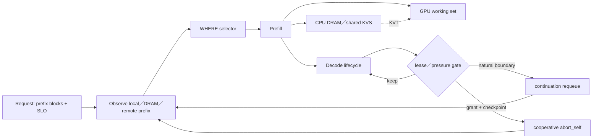

# Prefill Cache Simulator：策略价值与 benchmark 诚实性审计

- 作者：张珮文
- 数据与代码证据：`prefill-cache-sim@22e49bd`；报告修订：2026-08-08；M12 final grid 54／54 完成；KVS sizing 已完成隔离变量重跑
- 数据集：Mooncake `mooncake_trace.jsonl`，23,608 requests，512-token prefix blocks
- 证据等级：论文原文＋本地 deterministic replay；真实 GPU／KVT／生产 shadow 仍未完成

## 先读这张术语卡

| 词 | 零背景解释 |
|---|---|
| Prefill | 把输入 prompt 算成后续生成需要的 KV 状态；输入越长，计算越贵 |
| KV cache | 保存已经算过的 prefix 状态；重复前缀可以少算一段 |
| Selector | 为请求选择 prefill node；每台 node 的 local cache 与 queue 不同 |
| KVT | KV Transfer，把 KV 状态从一台 node／一层存储搬到另一处 |
| P stream／D stream | Prefill 计算流／Decode 逐 token 生成流 |
| HoL blocking | Head-of-line blocking；一个长请求挡住后面短请求 |
| Goodput | 在 SLO 内完成的有效工作；不同 milestone 的归一化公式不同，数值不能跨表横比 |
| Load max／mean | 最忙 node 的负载／集群平均；1.0 最均衡，越大越偏斜 |
| Replica factor | 同一 cache block 平均复制到多少 nodes；越高越浪费有限容量 |
| Queue p95 | 95% 请求不超过的排队 token-work；本文 M4 数值不是毫秒 |

## 0. Data Description：这份 trace 到底给了什么

### 0.1 文件与字段

实际使用文件 SHA-256：`b434f1816a707f4bac697235588184ebc374c9907cb981bb65fb0643471fe711`，4.2 MiB，23,608 行 JSONL，覆盖相对时间 0～3,600,000 ms。每一行只有四个原生字段：

| 字段 | 含义 | 可以推导什么 | 不能推导什么 |
|---|---|---|---|
| `timestamp` | 相对到达时间，单位 ms | arrival order、inter-arrival、idle age | 真实日期；同毫秒内的真实先后 |
| `input_length` | prompt token 数 | prefill work、tail block 大小 | token 内容、语义、模型 template |
| `output_length` | decode token 数 | decode work proxy | 实际 TPOT、finish reason、优先级 |
| `hash_ids` | 512-token block 的 chained prefix hash ID | exact-prefix reuse relationship | 原始 token、session_id、user_id |

数据文件实测统计：

| 指标 | 值 |
|---|---:|
| Requests | 23,608 |
| Input tokens | 202,791,701；mean 8,589.96；median 6,345；interpolated P95 26,078.55；range 890～125,546 |
| Output tokens | 4,299,817；mean 182.13；median 30；P95 600；range 1～2,000 |
| Block references | 409,356 |
| Unique block IDs | 183,166 |
| Partial-tail requests | 23,581／23,608 |
| Unique timestamps | 1,180；adjacent same-timestamp pairs 22,428 |

论文正文写 average input length 7,590，但当前公开文件的精确和是 202,791,701，除以 23,608 得 8,589.96。本仓所有结果以固定 SHA 的实际文件为准，不修改数据去贴论文平均值。

### 0.2 为什么 block size 是 512

论文定义 `hash_ids[i]` 为第 `i` 个 512-token block 的 prefix hash：它不仅包含当前 block，还链入之前所有 block。因此相同 ID 表示“从 prompt 开头到这里都一致”。一条 `input_length=6,755` 的请求有 `ceil(6755/512)=14` 个 ID；前 13 块各 512 tokens，最后一块 99 tokens。loader 在 `trace.py:104-120` 严格验证这个关系。

这也决定了命中必须是 strict prefix：如果 block 0、1 命中，block 2 miss，即使 block 3 恰好 resident，也不能跳过 block 2 继续算 hit。实现见 `cache.py:45-71` 与 `analyzer.py:68-77`。

### 0.3 Block hit 与 Token-weighted hit

| Metric | 分子 | 分母 | 为什么两个数不同 |
|---|---|---|---|
| Block-ref hit | 所有请求中连续命中的 block reference 数 | 409,356 block references | 每块按 1 计数，partial tail 也算一块 |
| Token-weighted hit | 连续命中 block 实际覆盖的 token 数 | 202,791,701 input tokens | 完整块计 512，tail 按真实 token 数 |

无限容量、无过期、strict prefix 的 workload ceiling：

- Block-ref：`226,190 / 409,356 = 55.2550836%`。
- Token-weighted：`115,733,271 / 202,791,701 = 57.0700233%`。

Token-weighted 更高，说明被复用的完整长 block 略多，而大量 compulsory miss 落在短 tail。两个 metric 都是 cache reuse，不是 request hit rate，也不是 TTFT improvement。

### 0.4 Idle TTL 实验的准确假设

Idle TTL 是本仓额外的 diagnostic，不是 Mooncake Table 1，也不是论文配置。其假设必须完整写成：

1. **Capacity infinite**：不发生容量 eviction。
2. **Idle expiration**：`now - last_access > TTL` 时 block expire；不是“创建后固定寿命”。
3. **Hit renew**：命中的 block 把 `last_access` 刷新到当前 request timestamp，这等价于 LRU recency refresh。
4. **Strict prefix matching**：遇到第一个不存在或过期的 block，后续 block 全部不计 hit。
5. **Instantaneous trace-time insertion**：lookup 后把当前请求的 blocks 立即写入并更新时间；不模拟 prefill queue／completion visibility。
6. **Single global namespace**：不是 per-GPU cache，也没有 remote transfer cost。

| Idle TTL | Block-ref hit | Token-weighted hit |
|---:|---:|---:|
| 1 s | 28.81% | 29.77% |
| 5 s | 33.75% | 34.89% |
| 10 s | 33.95% | 35.08% |
| 30 s | 34.96% | 36.12% |
| 60 s | 37.92% | 39.17% |
| 120 s | 44.33% | 45.79% |
| 300 s | 51.10% | 52.78% |
| 600 s | 54.53% | 56.33% |
| 1,800 s | 55.22% | 57.04% |
| 3,600 s／∞ | 55.26% | 57.07% |

这张表只回答 temporal locality 能跨多长时间。它不包含 LRU capacity eviction；严格说是“infinite capacity＋idle expiry＋hit renew”，不能简称为“LRU benchmark”。

### 0.5 能否判断 session

**不能确定真实 session。**数据集没有 `session_id`、`conversation_id`、`user_id` 或 messages。论文只说采样时优先保留同 session 请求，以保存 caching relationships；这不等于 trace 暴露了 session label。

`hash_ids` 只能构造 causal prefix family proxy：

- 同一 session 的追加对话通常共享较长 prefix，因此可能被 link。
- 不同 session 也可能共享 system prompt／相同文档，因此会 false merge。
- 同一 session 如果 template、截断或上下文发生变化，也可能 false split。
- depth=1 只有 4 个 prefix families，最大 family 有 10,938 requests，证明第一块主要是超热公共前缀，不能拿它当 session key。
- 23,608 requests 只有 1,180 个不同 timestamp，同毫秒内无法恢复真实会话顺序。

S4 的 `OnlineConversationLinker` 因而明确是 online proxy：只使用当前请求之前见过的 prefix，要求 minimum shared blocks，排除 hot-only prefix，并设置 family size cap（`affinity.py:37-114`）。在真实系统里应替换为经过 privacy-safe hashing 的真实 session key；当前 S4 结果不能宣称是“真实 session selector 收益”。

## 1. 总体架构

### 1.0 给零背景读者的 30 秒版本

一个 LLM 请求先做 **prefill**：把输入 prompt 逐 token 计算成可以继续生成的 KV 状态；然后做 **decode**：基于这些状态逐 token 生成答案。长 prompt 的 prefill 很贵。如果下一条请求与过去请求共享开头，就可以直接复用已经算好的 prefix KV blocks。

关键约束是：每台 prefill node 的 local cache 不一样。同一条重复 prefix 如果每次被发到不同 node，就会发生 location miss，明明集群里算过，当前 node 仍要重算。因此 selector 同时影响两件事：

1. **Reuse**：把共享 prefix 的请求聚到持有 cache 的 node。
2. **Throughput／SLO**：避免所有热请求粘到同一 node，导致 queue、TTFT 与 tail latency 爆炸。

```text
Request → 切成 512-token chained prefix blocks
        → selector 选择 prefill node
        → node local cache 连续查找
        → 命中部分直接复用，首个 miss 后重算
        → 新 KV 写回 local cache／shared KVS
        → decode 在 D stream 继续执行
```

这就是本文的中心矛盾：**只追 hit 会形成 hotspot；只追空闲会打散 cache。真正的目标是 completed goodput，而不是单一 hit rate。**

### 先给结论

1. **这份 trace 的 exact-prefix workload ceiling 是约 51%～57%，不是 90%。**论文的 global LRU infinite-capacity 是 0.51；本仓按 block reference 复算为 55.255%，按 token 加权为 57.070%。
2. **当前已实证的最大机制收益来自“把相同前缀重新聚到一起”，但没有无条件 winner。**在 M4 的 100ms delayed-view headline 中，S3 从 Random 的 44.30% 提升到 54.01%，代价是 request load max/mean=1.822；在 fresh view（0ms）下，S5 反而以 53.01% hit＋queue p95 1220 同时优于 S3。视图质量决定应该偏向 stable ownership 还是动态 cost score。
3. **最值钱的设计不是单个 selector，而是 KVS-aware、SLO-aware 的统一 marginal-cost decision。**它把 `local reuse`、`remote transfer`、`recompute`、`queue`、`SLO risk` 放进同一个选择题，并允许在 D stream 过载时避免继续浪费 GPU work。
4. **Decode lease／cooperative preemption 的潜在收益可能比剩余 cache hit 更大，但证据最弱。**D1 在单 D node 的极端阻塞中把 strict goodput 从 0.00718 提到 0.14181，约 19.7×；到 2 个 D node 时反而低于 D0。它是 pressure tool，不是 always-on policy。
5. **当前 tier 假设没有伪造 Mooncake benchmark，但不能称为 Mooncake reproduction。**prefix 语义、LRU、global DRAM/KVS、remote-vs-recompute 都同构；GPU residency、layer-wise overlap、SSD swap、network congestion、真实 TTFT/TBT 尚未被硬件标定。



## 2. 详细设计

### 2.1 理论上限：先分清三种 ceiling

| 层级 | 数字 | 它回答什么 | 不能回答什么 |
|---|---:|---|---|
| Mooncake global LRU，Inf | 51% | 论文 Table 1 的单 global cache 口径 | 多节点 local selector 的命中 |
| 本仓 block-ref ceiling | 55.255% | block reference 是否曾经出现并可连续复用 | token 节省比例 |
| 本仓 token-weighted ceiling | 57.070% | 最多多少 input tokens 可由 exact prefix 提供 | TTFT／goodput |
| 90% reuse | 另一个 workload | chat-to-paper 等重复长上下文 | 这份 arxiv trace 的上限 |

代码入口：`src/prefill_cache_sim/analyzer.py`；trace prefix 必须连续命中，见 `cache.py:45-71`。

### 2.2 Selector：每种方案赚什么、卡在哪里

```python
# src/prefill_cache_sim/selectors.py:218-238
hit = cache_hits.get(node.node_id, (0, 0))[1]
score = load(node) + request.input_tokens - cache_discount * hit
# 中心化 master 风格：queue work 与 saved prefill work 合成一个近似分数。
```

| 策略 | 决策规则 | M4 token hit | 最大收益点 | 瓶颈／诚实边界 |
|---|---|---:|---|---|
| S0 Random | 均匀随机 | 44.30% | 无偏 baseline | 打散 temporal locality |
| S1 RoundRobin | 请求轮转 | 44.25% | request load max/mean=1.0 | 不看 token work 与 prefix |
| S2 LeastWork | 最少 running＋queued tokens | 43.67% | 负载感知 | 主动打散 prefix，命中最低 |
| S3 GBPrefixBucket | prefix anchor stable owner；过载 bounded fallback | **54.01%** | delayed view 下最大化 locality | load max/mean=1.822；不是无条件 winner |
| S4 SessionAffinity | 在线 conversation link＋sticky owner | 53.34% | 命中接近 S3，load max/mean=1.047 | trace 没有真实 session_id，linker 是推断 |
| S5 CentralizedMasterTtft | queue＋input−0.7×hit | 52.32% | fresh view 下 hit／queue 同时最好 | 50ms stale view 触发 herding，queue p95=6589 |
| S6 CalibratedTtft | `(load＋uncached)×coefficient` | 53.37% | 接近 Mooncake estimated TTFT 形式 | coefficient 仍是 synthetic；没有真实 KVT congestion |

S3／S4 的 capacity gate 与 fallback 在 `selectors.py:65-119,127-209`。S5／S6 在 `selectors.py:212-268`。

#### 2.2.1 实验契约：这些数字到底在什么世界里成立

M4 headline 的统一配置是：4 个 prefill nodes、集群总容量 50,000 blocks、E1 LRU、请求排队、prefill 完成后才写 cache、100ms delayed cluster view、seed 713。数据来自 `results/m4/results.csv` 的 `A1-*` rows。

| 变量 | M4 的含义 | 为什么影响排名 |
|---|---|---|
| Per-node local cache | 每台 node 只看到自己的 12,500 blocks | 同 prefix 被分散就产生副本与 location miss |
| Delayed view=100ms | load、cache hit estimate、last-selected 都来自冻结快照 | 动态 argmin 会在窗口内反复追同一个“最优”node |
| Insert at completion | prefill 完成前，其他请求看不到新 KV | concurrent duplicate compute 不会被假装成 hit |
| Strict prefix | 首个 miss 后停止计 hit | 不允许跳过中间 miss“作弊” |
| Normalized work | queue 是 token-work proxy，不是真实毫秒 | 只能比较相对趋势，不能发布 production TTFT |

#### 2.2.2 S0／S1／S2：先建立三个朴素 baseline

| 策略 | 输入与伪码 | 它验证什么 | M4 结果与瓶颈 |
|---|---|---|---|
| S0 Random | `uniform(alive_nodes)` | 不带偏好的基准 | hit 44.30%；load max／mean 1.013；queue p95 4097。均衡，但打散 locality |
| S1 RoundRobin | `node = nodes[counter % N]` | request-count 均衡 | hit 44.25%；request load=1.0；queue p95 3876。不同长度请求使 count 均衡不等于 work 均衡 |
| S2 LeastWork | `argmin(running_tokens + queued_uncached_tokens)` | 纯负载感知是否够用 | hit 43.67%；load max／mean 1.012；queue p95 **8061**。stale snapshot 下形成 herd effect |

S2 是重要反例：动态追“最闲”不一定减少排队。多个请求在同一冻结窗口看到同一个最闲 node，会一起涌过去；下一次刷新时再一起转向另一台 node。它说明分布式 selector 的输入 freshness 本身就是算法的一部分。

#### 2.2.3 S3 GBPrefixBucket：代码里到底是哪一个 selector

S3 对应 `src/prefill_cache_sim/selectors.py:182-194` 的 `gb_prefix_bucket_selector()`。它不是 中心化 master，也不是全局 batching 本身；“GB”表示用 Global Batching 风格的 prefix bucket owner 思路做的实验策略。

```python
return AffinitySelector(
    PrefixAnchor(anchor_k),                  # M4 headline：k=2
    CapacityGate(soft_alpha=1.25),           # owner load > 1.25 × cluster mean
    BoundedFallback(max_secondary_candidates=2),
    sticky=False,
)
```

完整决策流程：

```text
request
  → 取第 k 个 chained prefix block；短请求取最后一个
  → SHA256(anchor) % N 得到 stable owner
  → owner 未超过 hard／soft gate：选择 owner
  → owner 过载：只检查 hash ring 后两个 secondary nodes
  → secondary 都不合格：fail-open 到 cluster least-work
```

为什么它在 M4 headline 的 hit 高：

1. 相同第 2 段 prefix 的请求稳定回到同一 owner，减少 cache fragmentation。
2. replica factor 只有 1.045，Random 是约 1.23；有限容量被重复副本浪费得更少。
3. 它不依赖每 100ms 才更新一次的 load 排名；owner 在 stale view 下仍稳定。

为什么它不能直接部署为 winner：

1. 热 prefix 的 stable owner 会持续集中流量，request load max／mean=1.822。
2. `k=2` 是这条 trace 的经验点：k=1 hit 45.18%，k=4 hit 53.61%，k=16 hit 51.96%；不能外推到所有 workload。
3. 100ms headline 中的 54.01% 包含“ownership 集中”的收益；fresh view 下 S3 只有 49.90%，而 S5 是 53.01%。
4. M12 同名 S3 使用第 1 块 anchor，并非 M4 的 k=2 版本。

#### 2.2.4 S4 SessionAffinity：没有 session_id，怎么做 session selector

S4 对应 `session_affinity_selector()`＋`OnlineConversationLinker`。它不是读取真实 session；trace 没有这个字段。它只用过去看到的 prefix 构造 causal family proxy：

```text
从最长共享 prefix 向前查找
  → 少于 minimum_shared_blocks：新 family
  → 只由全局超热 blocks 构成：拒绝合并
  → family 已到 size cap：切新 family
  → 否则加入旧 family，并 sticky 到上次 owner
```

hot-only exclusion 防止公共 system prompt 把全流量合并成一个“假 session”；family cap 防止一个大 conversation family 永久霸占一台 node。M4 中它得到 53.34% hit、load max／mean 1.047、queue p95 3011：比 S3 少 0.67pp hit，但把严重偏斜压回近似均衡。因此在 delayed-view 契约里，S4 是比 S3 更合理的部署候选；生产中应把 proxy key 换成 privacy-safe hashed session key。

#### 2.2.5 S5 中心化 master TTFT：为什么中心化 cache-aware 反而输给 S3

S5 对应 `CentralizedMasterTtftSelector`：

```python
load = running_tokens + queued_uncached_tokens
hit = estimated_local_hit_tokens
score = load + input_tokens - 0.7 * hit
```

它先按 score 排序，保留 top 30%，再取距 best 10% band 内最久未选的 node。直觉是：queue 少、local hit 多的 node 预计 TTFT 更短。

M4 headline 中它看起来较差，主因不是公式，而是 **stale-view herding**：

| View delay | S5 token hit | Load max／mean | Queue p95 |
|---:|---:|---:|---:|
| 0ms | **53.01%** | 1.272 | **1220** |
| 50ms | 52.32% | 1.646 | 6589 |
| 500ms | 52.32% | 1.646 | 6589 |
| 5000ms | 51.33% | 1.558 | 9123 |

`delay=0` 时，S5 在 hit 与 queue 两轴同时优于 S3／S4；50ms 后 queue 变成 5.4 倍。连用于打散选择的 `last_selected_ms` 也是快照字段，所以同一冻结窗口内的请求会重复选中同一个 node。discount 和 band 扫描只能改变个位数百分比，不能解释 5.4 倍退化。

结论不是“中心化 master 不好”，而是：**中心化 cost selector 的实际能力上限由观测 freshness 决定。生产 中心化 master 是否存在同样问题仍是假说，需要对照真实 view refresh、RPC delay 与 node queue oscillation。**

#### 2.2.6 S6 CalibratedTTFT：校准了什么，为什么没完全救回 S5

S6 把 S5 的经验折扣改成单位一致的 uncached work：

```python
uncached = input_tokens - hit_tokens
score_ms = (queue_tokens + uncached) * prefill_uncached_token_ms
```

它让公式更容易接入真实硬件 coefficient，也避免 `0.7 × hit` 的经验权重。M4 headline hit 从 S5 的 52.32% 回到 53.37%，skew 从 1.646 降到 1.269，但 queue p95 仍是 6393。原因是它校准了 score，没有修复 score 输入的 freshness；错误的新鲜度比错误的系数更致命。

#### 2.2.7 一张图读懂 M4：没有单指标冠军

| 策略 | Token hit | Request load max／mean | Queue p95 | 最诚实定位 |
|---|---:|---:|---:|---|
| S0 Random | 44.30% | 1.013 | 4097 | baseline |
| S1 RR | 44.25% | **1.000** | 3876 | count balance baseline |
| S2 LeastWork | 43.67% | 1.012 | **8061** | stale-view 反例 |
| S3 GBPrefixBucket | **54.01%** | 1.822 | 3103 | locality ceiling probe |
| S4 SessionAffinity | 53.34% | 1.047 | **3011** | delayed-view Pareto candidate |
| S5 中心化 master TTFT | 52.32% | 1.646 | 6589 | fresh-view winner／stale-view loser |
| S6 CalibratedTTFT | 53.37% | 1.269 | 6393 | 可标定 score，仍受 stale view 限制 |

M4 的可迁移 insight 是一条切换规则：**view 可信时追 cost score；view 不可信时靠 stable ownership；两者之间用 overload gate、bounded choice 与 randomized tie-break 防 herd。**

#### 2.2.8 M4 与 M12：同名策略为什么不能直接横比

| 维度 | M4 | M12 placement grid | 解读限制 |
|---|---|---|---|
| Workload | 23,608 条 Mooncake trace | 同一 Mooncake trace＋合成 cost regimes；arrival scale=5.0 | workload 身份相同，但后续 contract 不同 |
| View | 100ms delayed headline | causal exact view | S5 的主要弱点被移除 |
| S3 anchor | 第 2 块 | 第 1 块 | 同名但不是同一变体 |
| S4 | dynamic P99 hot threshold；cap=128 | cohort namespaced；cap=64 | family 语义不同 |
| Cache pressure | 50k blocks＋LRU eviction | placement-only case 容量覆盖 keys | M12 placement hit 不测相同 eviction 压力 |
| KVS | 无 remote | NORMAL／EXPENSIVE／DISABLED | S5/S6 在部分 cell 能 remote，但 score 未完整定价 transfer |
| Candidate gate | alive nodes | cohort＋SLO eligibility | M12 所有策略先共享 prefilter |

M12 已冻结的旧 placement artifact 只支持“在特定 COMPUTE_BOUND-DISABLED cell，S5 strict useful goodput=6.634、load=1.002，hit=56.794% 与 S4 的 56.788% 实质持平；S5 的明确优势在 goodput 与 P queue p95”。这里的 6.634 是 M12 自己的 normalized strict-useful-work rate，不能与 M6 的 0.4883 或 M7 的 0.14181 横比。它不能证明 S5 普适最佳，也不能与 M4 的 52.32% 直接作升降比较。最终 grid 已完成；G12-3 只保留 overload-only，G12-4 kill／narrow，KVS／Decode／eviction 均没有取得常态 enforcement 证据。

#### 2.2.9 KVS／SLO-aware：从“找 hit”升级为“给每个选择定价”

面向大规模分布式系统，node selection 不应只问“哪里 hit 最长”，而要先过滤不可行候选，再比较完成请求的边际成本：

```text
request + model/adapter/work-shape + SLO slack
  → cohort filter：只保留兼容 nodes
  → SLO eligibility：排除 queue＋compute＋KVS contention 已超预算的 nodes
  → 对每个候选算账：
       queue_cost
     + uncached_prefill_tokens × prefill_price
     + remote_KV_tokens × KVS_price × contention_multiplier
     + owner_break／fairness／risk penalty
  → local reuse、remote fetch、recompute 三者取总成本最低
  → 只在 safety gate 通过时 enforce；否则 shadow／fallback
```

Hybrid 使用 Mooncake 风格 threshold：只有 remote 方案相对 local recompute 的收益达到阈值才 transfer。PricedSpill 则把 transfer 直接放进统一 ledger。它的最大价值不是再多几个 hit points，而是允许 selector 在“粘住 cache 热点”和“打散后全部重算”之间选择第三条路：**把 KV 搬到空闲 node。**

当前诚实结论：PricedSpill 的旧 G12-2 grid 为 13 个 `KILL_ENFORCEMENT`＋2 个 provisional duplicate pass，只能保留 shadow／ablation；修复后的 final grid 已完成，但没有把价格函数升级为可 enforcement。统一成本框架值得继续，当前具体价格函数仍未通过 enforcement gate。

### 2.3 Eviction：LRU 是 benchmark 主线，复杂策略是容量压力实验

| 策略 | 代码语义 | 与 Mooncake 的关系 | 最大收益点 | 瓶颈 |
|---|---|---|---|---|
| E0 FIFO | hit 不刷新 | 题目要求的 baseline | 简单、可解释 | 不利用 temporal locality |
| E1 LRU | hit 后 move-to-end | **论文 Table 1 最优策略** | 最符合这份 trace 的时间局部性 | 不识别 one-hit pollution／block value |
| E2 SLRU | probation hit 后进 protected | Mooncake 未报告 | 隔离一次性 block | protected 80% 是实验参数，不是论文参数 |
| E3 Second-hit | 第一次仅进 bounded ghost | Mooncake 未报告 | 抑制 one-hit pollution | 可能拒绝首次进入但马上会复用的长 prefix |
| E4 Chain-aware | 保护连续 prefix／价值 | 研究扩展 | 减少 stranded suffix | 不在 M4 主 runner；价值函数尚未硬件验证 |

核心代码：`eviction.py:11-57`、`eviction.py:59-107`、`eviction.py:110-128`。Mooncake 只明确说 CPU paged blocks 可用 LRU／LFU／request-aware，并在这份 trace 上报告 LRU 最优。

### 2.4 KVS topology：真正有价值的是“取还是算”的经济判断

```python
# src/prefill_cache_sim/kvs.py:88-100
transfer = fixed_latency + tokens * bytes_per_token * 8 / bandwidth
non_overlapped = transfer * (1 - overlap_ratio)
effective = max(non_overlapped, recompute_work)
```

| Topology | 路径 | 最大收益点 | 当前瓶颈 |
|---|---|---|---|
| LOCAL_ONLY | local HBM → recompute | 无网络，状态简单 | selector 错配即丢失跨节点复用 |
| SHARED_KVS | local HBM → remote KVS → recompute | 把 location miss 变成 transfer | M5 参数不是硬件毫秒；网络热点只用简化计数 |
| HYBRID | local HBM → local DRAM → remote KVS → recompute | 最接近 Mooncake tier intent | 没有真实 async layer-wise overlap 与 SSD queue |

M5 模型中的共享层约带来 4.7% effective-prefix/cost 改善，但这不是“命中率增加 4.7 pp”，也不是硬件加速比。tier conservation invariant 在 `kvs.py:43-71`；remote LRU copies 在 `kvs.py:103-201`；四段连续来源在 `kvs.py:272-330`。

### 2.5 Protocol、SLO 与 decode lifecycle

| 方案 | 最大收益点 | 已有结果 | 主要瓶颈 |
|---|---|---:|---|
| P0 PD | 基础 P／D 分离 | strict goodput 0.4883 | 不做 gated admission |
| P1 DP | baseline colocated path | 0.2939 | 当前 normalized 参数下最弱，不代表真实 DP |
| P2 GATED_PD | SLO gate 避免无效完整链路 | **0.6870** | 依赖可相信的 P/D cost model |
| P3 GATED_DP | gated colocated path | 0.5787 | 同样缺硬件标定 |
| D0 | 无边界、无恢复成本 | 2+ D nodes 通常更好 | 单节点长请求 HoL blocking |
| D1 Fixed lease | 自然 LENGTH 边界后重排队 | 1 D node 约 19.7× | 2 D nodes 反而下降；boundary/recompute cost |
| D1.5 Adaptive lease | 只在压力高时缩短 quantum | boundaries 12.92→4.95 | pressure estimator 尚未校准 |
| D2 Cooperative preemption | checkpoint 后安全让位 | 仅 upper-bound spike | resume、durable ack、epoch fencing、重复输出风险 |

D1 的恢复路径在 `decode_lease.py:174-221`；自适应 quantum 在 `decode_lease.py:226-236`。D2 的 keep/move 价值函数、minimum quantum、bounded preemption 与 safety margin 在 `preemption.py:193-221`。

## 3. 关键技术评估

### 3.1 当前收益排行榜

| 排名 | 能力 | 最大已观察收益 | 证据强度 | 判断 |
|---:|---|---:|---|---|
| 1 | Prefix locality restoration（S3） | +9.71 pp token hit vs Random | SYNTHETIC_REPLAY，真实 trace | **最确定的收益；S3 作 ceiling probe** |
| 2 | Gated-PD | strict goodput 0.4883→0.6870 | NORMALIZED_WORK | **架构价值高，但收益可随权重变号** |
| 3 | Decode lease under severe pressure | 单 D node：0.00718→0.14181 | 病理 HoL synthetic | **单点病理救援，非病理配置无正收益证据** |
| 4 | Shared KVS | 约 4.7% modeled cost/effective-prefix benefit | synthetic KVT | **是 SLO selector 的基础，不是独立神技** |
| 5 | D2 preemption | 尚无可信绝对收益 | upper-bound only | **战略 option，当前不能估值** |

### 3.1.1 Production baseline 错配警告

`+9.71 pp` 只表示 S3 相对 **Random** 的 locality mechanism gain，不能当作相对线上收益。M4 中 production-style cache-aware baseline 已达到 S5=52.32%、S6=53.37%；S3=54.01% 相对它们只有约 0.6～1.7 pp simulator headroom，S4=53.34% 与 S6 基本持平。DashScope 线上已有 中心化 master／Turbo cache-aware owner，因此任何“生产提升”目前都是 NOT_MEASURED，必须由 R1 shadow 给出。

S4 更合理的 value statement 是：**在本次 replay 中，用约 0.67 pp token hit 代价，把 request load max/mean 从 1.822 降到 1.047；按原值降幅为 42.5%，按超出理想值 1.0 的 excess-skew 口径降幅约 94%**。这里描述的是 simulator trade-off，不是生产收益。

### 3.2 价值不是相加关系

```text
S3 locality gain
 KVS remote reachability
 SLO gate
 decode lease
 cooperative preemption
 ≠ 各自收益直接相加
```

S3 的 54.01% 距无限单池 token ceiling 57.07% 约 3.06 pp，但有限多节点 local cache 与无限单池容量域不同，不能把 94.6% 当严格效率证明。KVS 的价值转向“允许不为命中而粘死热点节点”；SLO gate 的价值是判断 remote fetch 是否值得；decode control 的价值来自避免 HoL 与注定失败的 work。三者是互补的控制面，不是独立加速器。

部署形态更值得优先验证 **真实 session_id 版 S4**：它用 0.67 pp hit 差距把 load max/mean 从 1.822 降到 1.047。S3 保留为 locality ceiling probe，不直接等同 production winner。

敏感性边界同样重要：`results/m6/results.csv` 中 `lambda_risk=2.0` 时 P2 strict goodput=0.4437，低于 P0=0.4883；gate 收益依赖未硬件标定的风险权重。D1 在 2 个 D nodes 时为 0.6235，低于 D0=0.6846；`migrate_on_boundary=True` 时跌到 0.00153。19.7× 只描述单 D node 的病理 HoL case，不能作为 headline 收益。

### 3.3 我认为最值钱的部分

**最值钱的是：把 cache reuse 从一个 selector feature，升级成 request lifecycle 的可恢复 marginal-cost decision。**

判断依据：

1. 单纯 prefix routing 已接近 workload ceiling，剩余 hit 空间有限。
2. Mooncake 自己的 Algorithm 1 也不是最大化 hit，而是比较 `queue＋prefill` 与 `transfer＋queue＋prefill`，并以 TTFT/TBT SLO 决定是否接收。
3. 你的设计再向前一步：WHERE 仍交给现有 Global Batching／中心化 master／Turbo owner；client 持有 attempt、lease、checkpoint、output authority 和 retry budget。
4. 因而同一套账可以回答四个业务问题：发哪台 P、KV 从哪里来、D 是否继续占用、失败后从哪里恢复。
5. 这部分的价值不受 arxiv trace 57% ceiling 限制，因为它优化的是 completed goodput、fairness 和 wasted GPU work，而不只是 prefix hit。

证据层级必须拆开：**admission gating＋WHERE／lifecycle 归属分离**有本仓 replay 与协议证据；五元统一比价中的 remote 分支目前只有约 4.7% modeled evidence，统一框架主要依据 Mooncake Algorithm 1 的同构逻辑与 architecture reasoning；D2 仍没有真实 resume evidence。

## 4. 风险与备选

### 4.1 Benchmark fidelity 审计

| 假设 | 状态 | 是否作弊 | 原因／修正 |
|---|---|---|---|
| 512-token chained prefix hash | 符合 | 否 | 与论文 trace 定义一致 |
| prefix 必须从 block 0 连续命中 | 符合 | 否 | `cache.py:45-71`，不能跳过中间 miss |
| E1 LRU 作为主 baseline | 符合 | 否 | 论文 Table 1 在该 trace 上 LRU 最优 |
| 本仓 55.26% 与论文 51% 并列报告 | 有口径差异 | 否，前提是明确分母 | 禁止宣称复现了论文 0.51 |
| M4 多节点 local capacity 对比论文 global capacity | 不同实验 | **直接横比会作弊** | 必须增加 single-global parity runner |
| GPU cache 用 block capacity＋LRU 表示 | 粗化 | 非作弊，但不是 reproduction | Mooncake prefill GPU 是 request working set，layer-wise dump；应标 model abstraction |
| CPU DRAM／remote store 用 LRU copies | 部分符合 | 否 | 论文允许 LRU，但还有 replication／swap／congestion |
| SSD tier 未单独实现 | 缺失 | 不可声称覆盖 | 当前 remote store 不能改名成 SSD benchmark |
| 固定 bandwidth／latency／overlap | synthetic | 当作真实 ms 会作弊 | M9-HW 前只报 normalized/model result |
| oracle cache view | 上界 | 当作生产结果会作弊 | delayed/loss view 必须作为现实压力臂 |
| trace 推断 session affinity | proxy | 当作真实 session selector 会作弊 | 需真实 session_id shadow 对照 |
| decode resume 100% 成功 | upper bound | 当作 D2 收益会作弊 | 当前 artifact 已标 `ASSUME_RESUME_SUCCESS_UPPER_BOUND` |

### 4.2 GPU／CPU／storage 正确建模边界

| Tier | Mooncake 真实语义 | 当前 simulator | 缺少的 benchmark |
|---|---|---|---|
| GPU VRAM | prefill 单请求 working set；layer-wise async load/store；decode batch KV capacity | local block cache＋并发队列 | resident token-seconds、layer overlap、fragmentation、batch TBT |
| CPU DRAM | paged global KV pool；LRU/LFU/request-aware；RDMA holder | local DRAM＋remote holder LRU | NUMA、allocator、RDMA registration、热点发送端 congestion |
| SSD | cold KV swap，降低 DRAM reservation cost | 未独立建模 | read/write bandwidth、IOPS、queue、promotion、write amplification |

结论：**当前淘汰机制适合策略排序，不足以复现 Mooncake hardware benchmark。**最安全的说法是“trace-faithful prefix replay＋parameterized tier model”。

## 5. 老板版验收：先把实验世界讲清楚

### 5.1 Trace 原生字段与人为实验参数

| Quantity | Trace 原生？ | 来源／取值 | 怎么理解 |
|---|---|---|---|
| Arrival、input／output length、512-token chained hashes | 是 | 23,608 requests | 真实 workload shape；没有 token 内容 |
| Tenant | 否 | request_id SHA-256 → 16 个 synthetic tenants | 只用于检查是否饿死某组流量 |
| Service tier | 否 | STRICT 20%／STANDARD 60%／RELAXED 20% | 与真实客户等级无关 |
| SLO budget | 否 | STRICT 5,000／STANDARD 20,000／RELAXED 100,000 work-time | 每条 request 从 arrival 到完整完成的 synthetic deadline；不是 1s／1.5s／2s |
| SLO attainment | 否 | 每个 tier 的按时完成数÷该 tier offered 数 | 例如 80% 是“100 条里至少 80 条按时完成”，不是 800ms |
| P／D／KVS cost | 否 | MIXED：recompute 0.06／remote fetch 0.01／Decode 1.00 work per token | 都是容易解释的 frozen assumption，尚未 hardware calibration |
| KVS bytes | 否 | 65,536 bytes／token | 只计算 modeled network traffic；不再由 bytes 反推 work price |

一条 request 的计算口径是：

```text
uncached_tokens = input_tokens − local_hit_tokens − remote_hit_tokens
P_work          = uncached_tokens × 0.06 work/token
KVS_work        = remote_hit_tokens × 0.01 work/token
KVS_bytes       = remote_hit_tokens × 65,536 bytes/token
D_work          = output_tokens × 1.00 work/token
request_slo_met = 完整输出且 finish_work_time − arrival_work_time ≤ tier_deadline_work
```

这里先把 Decode 1 token 的 modeled cost **定义为 1 work**，作为统一尺子。于是 MIXED world 中：local hit 不做 Prefill 或传输，增量成本记为 0；remote fetch 1 token 记为 0.01 work；完全 miss 后重算 1 token 记为 0.06 work；Decode 1 token 记为 1 work。`0`、`0.01` 与 `0.06` 都是人为 scenario 参数，不是 Mooncake 论文、trace 或 GPU benchmark 测出来的数字。尤其 local hit＝0 忽略了 lookup／assembly，会偏向高估 cache 收益，M9-HW 必须一起标定。

`work` 与 `work-time` 要分开读：work 是工作量；kernel 让每个 P 在 1 个 work-time 内处理 1 work，因此 queue 会把 finish work-time 往后推。Raw trace 的 `timestamp_ms` 数值被放进 arrival 轴，但这**不等于证明 1 work-time＝1ms**。因此当前只能写 STRICT deadline＝5,000 work-time，不能诚实地把它写成 1s。要得到 1s／1.5s／2s，必须先在目标 GPU／model／batch／KVS 链路上测出 `service_rate_work_per_ms`，再换算：`deadline_work = deadline_ms × service_rate_work_per_ms`。

Input length 不固定，直接使用 trace 中每条 request 的长度。等待时间计入 `finish−arrival`，所以“最终都跑完”不等于 SLO 通过。`minimum-tier attainment` 的算法是：分别计算 STRICT、STANDARD、RELAXED 的 `按时完整完成 request 数÷offered request 数`，再取三者最小值。它回答“最差服务等级有多少请求按时完成”，不是一个 latency 数值。

### 5.2 54 个 cell 是什么

一个 cell 是：固定 node、cost、arrival pressure 和 policy，从空 cache 开始完整重放全部 23,608 条 request。它不是一条 request，也不是一个 unit test。

- 45 primary＝3 个 synthetic cost regimes × 5 个 arrival scales × 3 个 candidate policies。
- 9 sensitivity＝3 个 regimes × 固定 1.5× stress × No-Gate／Oracle／Noised-Oracle。
- Arrival scale 只压缩请求间隔，不会把 input length 固定下来。
- Oracle 会看未来，只能作为上界，不能部署。

MIXED 1.5× Decode Causal 是专门构造的 overload stress cell，不代表平均情况：它把 decode credits 从 4,096 降到 128，并开启 abort／retry fence。Token hit 达到 76.11%，queue p95 下降 71.96%，但 strict output 对 No-Gate 下降 9.55%，minimum-tier 从 0.9358 降到 0.7531，并产生 17,795 retries。结论是只保留为 overload brake，不能宣称常态吞吐 winner。

Priced Spill 对 Baseline 只有＋0.266pp hit、＋0.0148% strict output、－0.107% queue p95；而 45 个 primary cells 全部 `capacity_binding=false`，所以当前没有真正测到“cache 塞满后扔谁”。这是 null result，不是 eviction 已被证明有效或无效。

### 5.3 Resource sizing 是另一套 24-cell 实验

Resource sizing 回答：在 completion、SLO、公平性和 queue 都过线时，最少需要几个 P。它是 3 种 topology × P=1～8＝24 次完整 replay，与 54-cell falsification grid 使用不同 arrival mapping、horizon 和 gate，数字不能混算。

三组统一使用 HYBRID routing、threshold=2.0，并关闭 capacity eviction，只改变 remote cache 是否可见与 transfer price。旧版 local 使用 S4、shared 使用 HYBRID，混入 selector 差异，因此旧 `3→2`、`7→4` 资源节省 headline 已撤回。

| Gate | Threshold | 白话含义 | 本次哪里 binding |
|---|---:|---|---|
| Completion | 100% | Horizon 内全部 request 完成 | 24 cells 全通过 |
| Tier deadline | 5,000／20,000／100,000 work-time | STRICT／STANDARD／RELAXED 每条 request 的 synthetic completion deadline | 决定每条 request 是否按时 |
| Minimum-tier SLO attainment | ≥80%；≥95% sensitivity | 三档分别算达标率后取最小值；80% 表示最差 tier 也至少 80% 按时 | P≥2 后决定 N* |
| Jain fairness | ≥0.90 | 16 个 synthetic tenants 的 token service ratio 是否接近 | 只在 P=1 失败 |
| P queue p95 | ≤20,000 work | 95% 决策点看到的 P backlog；不是 elapsed time 或 ms | 只在 P=1 失败 |
| KVS bytes／work | ≤1,000,000 | Remote transfer guardrail；不是真实 GB／s | 从未接近上限 |

P=1 虽然 completion=100%，但 minimum-tier=0、Jain=0.7154、queue backlog p95=3,851,640.90 work，因此“让请求无限排队，最后跑完”仍不及格。

| 最差 tier 必须达到的按时率 | Local-only N* | Shared KVS N* | Zero-price N* | 怎么读 |
|---:|---:|---:|---:|---|
| 75% | 2 | 2 | 2 | 无差异 |
| 78%～80% | 3 | **2** | 2 | 只有这段门槛，Shared 在本次 v1.2 run 少 1 个 P |
| 81%～93% | 3 | 3 | 81%～82% 时 zero-price 为 2，其余为 3 | priced Shared 与 Local 无资源差异 |
| 94% | 3 | 4 | 3 | Shared 反而多 1 个 P，说明 transfer／routing 可能抵消 reuse；根因尚未验证 |
| 95% | 4 | 4 | 4 | 严格门槛无资源差异 |
| 96% | 5 | 6 | 5 | Shared 反而多 1 个 P；禁止把 78%～80% 的收益外推 |
| 97% | ＞8 | ＞8 | ＞8 | Grid exhausted；禁止外推 |

这些同 P 对比不是为了证明 Shared 一定赢，而是隔离资源数量后回答“remote reuse 的收益有没有超过 transfer cost”。v1.2 的结果是：

- 24 个 cell 中，最差 tier 全部是 STRICT（共 4,780 条）。P=2 时 Local 有 3,701／4,780＝77.43% 按时，Shared 有 3,866／4,780＝80.88% 按时，即多 165 条 STRICT request；queue backlog p95 从 12,615.42 降到 11,446.36 work（－9.27%）；token hit 从 54.62% 升到 56.80%（＋2.18pp）。这个结果与“拥塞点 remote reuse 有帮助”一致，但尚未经过换 seed 验证。
- P=3：Local STRICT 为 4,504／4,780＝94.23%，Shared 为 4,485／4,780＝93.83%，Shared 反而低 0.40pp。这直接解释了 94% floor 为什么 Local 只需 3 P、Shared 需要 4 P；为什么 P=3 的 routing／hit mix／transfer interaction 变差仍未验证。
- P=4：Local 最差 tier 为 95.82%，Shared 为 95.90%，只增加 0.08pp；queue backlog p95 从 2,436.54 升到 2,445.12 work（＋0.35%）。这个结果与“资源较充足时收益接近零”一致，queue 还略差。
- P=2 Shared 的 9,105,525 remote tokens 产生 `9,105,525×0.01＝91,055.25 KVS work`，并记录 `9,105,525×65,536＝596.74GB` 十进制 modeled traffic。两个量分别用于成本账和流量账，不能相加，也不能当实测 GB／s。

因此可证明的只有一个窄结论：在当前 MIXED v1.2、synthetic tenant／SLO 与 P=2 拥塞点，Shared KVS 让更多 STRICT request 按时完成；它没有证明 production 节省 GPU，也没有证明所有 SLO floor 都更好。78%～80% band 来自 Local P=2 的 77.43% 与 Shared P=2 的 80.88% 两个 crossover，frontier 只按 1pp 步长扫描。

代码与证据：`src/prefill_cache_sim/m12_sizing.py`、`scripts/run_m12_sizing.py`、`results/m12-sizing-v1.2/{contract,cells,threshold-frontier,verdict,provenance,MANIFEST}`。目录名 `v1.2` 表示 metric／cost contract 版本，目录内的 `m12-sizing-v2.1` 表示 sizing CSV schema 版本，两者不是同一个版本号。v2.1 artifact 正在按新 schema 重跑；发布前会核对三档列与 manifest。

### 5.4 大规模 distributed PD 的当前选择

- 默认档：真实 session key 版 S4／stable prefix ownership＋bounded load gate。M4 100ms delayed-view 下，它相对 S3 少 0.67pp token hit，但 load skew 低 42.5%、queue p95 低 3.0%。
- Fresh-view 档：只有 cache／queue census 足够新鲜时才考虑中心化 master。0ms 下它相对 S4 多 3.05pp hit、queue p95 低 26.8%，但 stale view 会引发 herding；尚未找到 production 的安全 view-age 阈值。
- Shared KVS 档：优先看 `N*(SLO floor)` staircase 与同 P 的 tail improvement，不再单看 hit。
- Decode overload 档：Decode Causal 只作 brake；不能作为常态 throughput policy。

所有数字只在本 trace＋normalized simulator contract 内成立，不是 production TTFT／MFU／GPU 数承诺。

### 5.5 Kill／narrow criteria

1. **WHERE line kill**：R1 若显示 production baseline 距可用 locality ceiling 小于 2 pp，且 load skew 没有可改善空间，关闭 selector enforcement 线；保留 lifecycle RFC。
2. **S4 kill**：拿不到 privacy-safe real session key，S4 降为 research result；不把 prefix-family proxy 上线。
3. **Gated-PD narrow**：M9-HW 后若 P2 收益变号或小于 5%，降级为 overload-only protection，不作为常态 throughput optimization。
4. **证据不对称**：normalized simulation 的 kill 是有效筛选；pass 只算 provisional，必须经 M12-HW。

## 6. 引用

| 证据 | 位置 |
|---|---|
| Mooncake 架构、trace、Table 1、Algorithm 1 | https://arxiv.org/html/2407.00079v4 |
| Selector | `src/prefill_cache_sim/selectors.py:31-268` |
| Cache continuous-prefix semantics | `src/prefill_cache_sim/cache.py:45-160` |
| Eviction | `src/prefill_cache_sim/eviction.py:11-128` |
| Tiered KVS | `src/prefill_cache_sim/kvs.py:43-330` |
| Decode lease | `src/prefill_cache_sim/decode_lease.py:174-236` |
| Cooperative preemption | `src/prefill_cache_sim/preemption.py:95-229` |
| M4 selector results | `results/m4/summary.json` |
| M5–M10 artifacts | `results/m5/`～`results/m10-synthetic/` |
| M12 resource sizing v1.2 | `results/m12-sizing-v1.2/` |
| 生产接入边界 | `docs/m11-production-rfc.md` |
